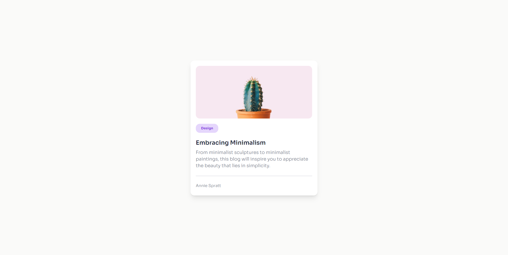

# Minimal-Blog-Card - #devChallenges

Este proyecto es un componente de tarjeta minimalista para mostrar información de blogs o artículos. Utiliza tecnologías como React y Tailwind CSS para crear una interfaz de usuario limpia y elegante.

## Tecnologías Utilizadas

- HTML
- CSS
- JavaScript
- React.js
- Tailwindcss

## Demo

Puedes ver una demostración de la aplicación en acción [Encryptor-Challenge](https://ibrahim-003.github.io/encryption-challenge/).

## Capturas de Pantalla

